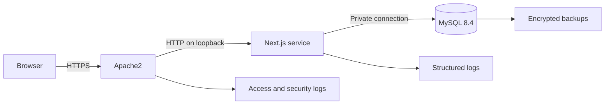

Astrotools Production Implementation Plan

Status: Implementation baseline
Prepared for: Codex
Date: 29 July 2026
Last updated: 1 August 2026
Initial production release: Field of View and Image Sampling

1. Purpose

Build a production-grade astrophotography calculation site that preserves the
strong visual language of the Astrotools Field Lab demonstrator, corrects its
conceptual and functional limitations, and establishes a platform on which
additional astrophotography calculators can be added without redesigning the
application.

Release 1 must help an astrophotographer answer four practical questions:

1. How much sky will this telescope, optical modifier and camera capture?
2. Will the selected astronomical target fit within the frame?
3. What image scale will the combination produce?
4. Is the combination plausibly undersampled, appropriately sampled or
oversampled for the stated seeing conditions?

The application must be deployable behind Apache HTTP Server 2.4 and use MySQL
for durable catalogue and configuration data.

The longer-term primary journey is equipment-first: a user enters their normal
telescope, camera and optical train once, bookmarks a stable Astrotools URL, and
can later reopen that URL to restore the same equipment without an account. The
restored setup leads to a compact calculation overview showing every result that
can be derived from that equipment, with clear links into each detailed
calculator.

2. Codex operating instruction

Codex must treat this document as the product and engineering baseline. Before
implementation, Codex must:

1. Inspect the repository and identify any existing assets worth retaining.
2. Create a concise root AGENTS.md containing the repository layout, commands,
engineering constraints, verification requirements and definition of done.
3. Create or update the architecture decision records identified in this plan.
4. Work in small, reviewable increments with tests and documentation included
in the same change as the behaviour they cover.
5. Never claim completion until the required checks have been run and their
results reviewed.
6. Stop and request a product decision only where this plan marks a decision as
unresolved or where implementation evidence materially invalidates an
assumption.

Codex should structure every implementation task using:

• Goal: the user-visible or operational outcome.
• Context: the relevant files, architecture decisions and existing
behaviour.
• Constraints: the rules and non-negotiable requirements in this plan.
• Done when: the explicit acceptance criteria and required tests.

3. Scope

3.1 Release 1 scope

Release 1 includes:

• A production homepage introducing the Field of View Lab.
• A telescope, camera and optical modifier configuration experience.
• Direct focal-length entry as the primary field-of-view input.
• Aperture and focal ratio as related telescope characteristics.
• Reducer, field-flattener and Barlow magnification factors.
• Camera presets and manual sensor configuration.
• Binning.
• Exact horizontal, vertical and diagonal field-of-view calculations.
• Image-scale calculation.
• Seeing input and a qualified sampling assessment.
• A target framing simulator with recognisable astronomical objects.
• A mathematically proportional frame and a separate display zoom.
• Properly typeset symbolic and substituted equations.
• Millimetre and inch display modes.
• Equipment and target catalogues held in MySQL.
• Shareable configurations encoded in stable URLs.
• Mobile, keyboard and screen-reader support.
• Production deployment behind Apache2.
• Automated unit, integration, accessibility and end-to-end tests.
• Operational documentation, logging, monitoring and backups.

3.2 Platform scope

The architecture must permit later calculators to be added through a calculator
registry and shared design system. Likely later modules include:

• Resolution and sampling
• Focal reducer and Barlow effects
• Sensor tilt
• Back-focus spacing
• Guiding ratio
• Drift and polar-alignment error
• Exposure and signal-to-noise estimation
• Mosaic planning
• Dew-point and heater-power estimation
• Storage and data-volume estimation
• A bookmarkable equipment workspace and consolidated calculation overview

These later calculators are not Release 1 deliverables.

3.3 Explicit non-goals for Release 1

• Social networking or community posting
• E-commerce or affiliate links
• Telescope-control integration
• Plate solving
• Live observatory control
• Native mobile applications
• Paid subscriptions
• Mandatory user registration
• Runtime dependency on an OpenAI API

Codex is the development agent. OpenAI services are not required by the
production application unless subsequently authorised as a separate feature.

4. Product principles

1. Scientifically honest: distinguish exact calculations, approximations,
configurable judgements and illustrative graphics.
2. Practical before decorative: every animation must help a user make a
decision.
3. Progressive disclosure: presets provide a fast route; manual values and
equations remain available to advanced users.
4. No hidden coupling: changing aperture must not silently invent a new
telescope unless the user deliberately chooses to derive focal length from
focal ratio.
5. Shareable by default: a useful configuration must be reproducible from
its URL without an account.
6. Accessible by design: accessibility is a release criterion, not a later
remediation activity.
7. Extensible without abstraction theatre: create shared calculator
primitives only after they are required by the first real calculator.
8. Equipment-first continuity: entering the same telescope, camera and optical
train separately in each calculator is a product failure. A bookmarked
equipment URL must restore the setup and make all applicable calculations easy
to scan before the user chooses a detailed tool.

5. Recommended production architecture

5.1 Architecture decision

Use a single TypeScript application behind Apache2:

• Public web server: Apache HTTP Server 2.4
• Application: current stable Next.js using the App Router
• Runtime: Node.js 24 LTS
• Language: TypeScript with strict type checking
• UI: React
• Database: MySQL 8.4 LTS using InnoDB
• Data access and migrations: current stable Prisma ORM with the MySQL
connector
• Process supervision: systemd
• Unit and component tests: Vitest and Testing Library
• End-to-end tests: Playwright
• Schema and input validation: Zod
• Code quality: ESLint and Prettier

The precise patch versions must be pinned in the lockfile when the repository is
created. Dependencies must not use floating version ranges in production.

Node.js recommends Active LTS or Maintenance LTS releases for production, and
Node.js 24 is LTS at the date of this plan:
Node.js release schedule.
MySQL describes 8.4 as an LTS series intended for stable behaviour and a longer
support period:
MySQL LTS model.

5.2 Why this architecture

• It preserves the proven React and TypeScript implementation model.
• One language covers browser, server, validation, database access and tests.
• Next.js can be self-hosted as a Node.js service, and its documentation
recommends placing a reverse proxy in front of the application:
Next.js self-hosting.
• Apache remains the only internet-facing web server and owns TLS termination,
request controls, response headers and proxying.
• Apache mod_proxy supports this reverse-proxy pattern:
Apache mod_proxy.
• Prisma provides typed MySQL access and managed migrations:
Prisma MySQL connector.

5.3 Deployment topology



Rules:

• Apache listens publicly on ports 80 and 443.
• Port 80 performs a permanent redirect to HTTPS.
• The Node service listens only on 127.0.0.1.
• MySQL listens only on localhost or a private network interface.
• ProxyRequests Off must be explicit.
• Apache must pass the original host and trusted forwarding information.
• The application must trust proxy headers only from the local Apache instance.
• The Node process runs as a dedicated, unprivileged service account.
• Production secrets reside outside the repository in a root-controlled
environment file or an approved secrets manager.

5.4 Rejected alternatives

Static React application plus a separate PHP API

Technically valid and Apache-native, but rejected as the default because it
introduces two application languages and duplicated validation, tooling and
deployment conventions for no present product benefit.

Exposing Next.js directly

Rejected. Apache must remain the public web server and security boundary.

Continuing with Vinext and OpenAI Sites

Rejected for the production target because the stated deployment environment is
Apache2 with MySQL. The demonstrator remains a visual and interaction reference,
not the production runtime baseline.

6. Repository structure

Codex should establish the following structure, adapting only where the selected
stable Next.js version requires a convention change:

```text
/
├── AGENTS.md
├── README.md
├── package.json
├── package-lock.json
├── next.config.ts
├── app/
│   ├── api/
│   ├── calculators/
│   │   └── field-of-view/
│   ├── layout.tsx
│   └── page.tsx
├── components/
│   ├── design-system/
│   ├── equations/
│   └── visualisation/
├── features/
│   └── field-of-view/
│       ├── components/
│       ├── model/
│       ├── schemas/
│       └── services/
├── lib/
│   ├── calculations/
│   ├── db/
│   ├── observability/
│   └── security/
├── prisma/
│   ├── schema.prisma
│   ├── migrations/
│   └── seed.ts
├── public/
│   └── targets/
├── tests/
│   ├── fixtures/
│   ├── integration/
│   └── e2e/
├── docs/
│   ├── product.md
│   ├── architecture.md
│   ├── calculations.md
│   ├── data-model.md
│   ├── accessibility.md
│   ├── security.md
│   └── operations.md
├── ops/
│   ├── apache/
│   │   └── astrotools.conf
│   ├── systemd/
│   │   └── astrotools.service
│   └── mysql/
└── scripts/
```

Business calculations must not be embedded inside React components. They belong
in pure functions under lib/calculations/ and must have no dependency on the
DOM, database or framework.

7. Domain model and calculations

7.1 Canonical units

All internal calculations use:

• Millimetres for aperture, focal length and physical sensor dimensions
• Micrometres for native pixel pitch
• Arcseconds for seeing and image scale
• Degrees for stored angular dimensions
• Dimensionless multipliers for reducers, flatteners and Barlows

The inches switch changes display and substituted-equation units only. It must
never alter canonical stored values or calculation results.

7.2 Effective focal length

[
f_{\mathrm{effective}} = f_{\mathrm{native}}
\prod_{i=1}^{n} m_i
]

where each (m_i) is an optical multiplier. Examples:

• 0.7x reducer: (m = 0.7)
• 2x Barlow: (m = 2.0)

The UI must identify whether a modifier also changes the effective focal ratio.

7.3 Effective focal ratio

[
N_{\mathrm{effective}} =
\frac{f_{\mathrm{effective}}}{D}
]

where (D) is aperture.

Focal length is the principal field-of-view input. Aperture is not presented as
though it independently changes field of view.

7.4 Physical sensor dimensions

Where catalogue dimensions are unavailable:

[
d_x = \frac{p_x s}{1000}
\qquad
d_y = \frac{p_y s}{1000}
]

where:

• (p_x) and (p_y) are pixel counts
• (s) is pixel pitch in micrometres
• (d_x) and (d_y) are sensor dimensions in millimetres

If both catalogue dimensions and derived dimensions exist, the seed validation
must flag a discrepancy exceeding an agreed tolerance, initially 0.1 mm.

7.5 Exact field of view

[
\theta_x =
2 \arctan\left(\frac{d_x}{2f_{\mathrm{effective}}}\right)
\frac{180^\circ}{\pi}
]

[
\theta_y =
2 \arctan\left(\frac{d_y}{2f_{\mathrm{effective}}}\right)
\frac{180^\circ}{\pi}
]

[
\theta_d =
2 \arctan\left(
\frac{\sqrt{d_x^2+d_y^2}}{2f_{\mathrm{effective}}}
\right)
\frac{180^\circ}{\pi}
]

Use (\arctan), not (\tan^{-1}), in the explanatory interface to avoid
reciprocal ambiguity.

The site may show the small-angle approximation for education, but the
calculator must use the exact equation.

7.6 Image scale

[
\rho =
\frac{206.265,s_{\mathrm{effective}}}
{f_{\mathrm{effective}}}
]

where (\rho) is arcseconds per pixel.

For binning factor (b):

[
s_{\mathrm{effective}} = s b
]

The implementation and help text must distinguish true hardware binning from
software resampling where that distinction affects interpretation.

7.7 Seeing and sampling

[
P_{\mathrm{FWHM}} =
\frac{\sigma_{\mathrm{seeing}}}{\rho}
]

where (P_{\mathrm{FWHM}}) is the approximate number of pixels across the
seeing-limited stellar full width at half maximum.

The assessment must be deliberately qualified:

• Fewer than 2 pixels per FWHM: likely undersampled
• 2 to 4 pixels per FWHM: broadly appropriate for many conditions
• More than 4 pixels per FWHM: likely oversampled for the stated seeing

These thresholds are explanatory defaults, not universal laws. The interface
must state that tracking, focus, optics, processing method and target type also
matter. Thresholds must be centralised constants with tests, not scattered UI
conditions.

7.8 Numerical integrity

• Use full JavaScript Number precision during calculation.
• Round only when formatting for display.
• Never feed rounded display values back into calculations.
• MySQL catalogue values use suitable DECIMAL columns rather than approximate
FLOAT columns.
• Every equation must have golden test cases independently verified against a
trusted reference calculation.
• Include dimensional consistency tests proving that switching between
millimetres and inches leaves angular results unchanged.

8. User experience requirements

8.1 Input hierarchy

The equipment panel must follow this order:

1. Telescope preset or manual telescope
2. Native focal length
3. Aperture
4. Optional optical modifiers
5. Camera preset or manual camera
6. Binning
7. Seeing
8. Target

Focal ratio is calculated when focal length and aperture are available. Provide
an explicit alternate mode to derive focal length from aperture and focal ratio,
but do not make that the default.

8.2 Presets and manual override

• Search equipment by manufacturer and model.
• Selecting a preset populates all known values.
• Each populated value remains visible.
• A user can switch to manual mode without losing the current values.
• Modified preset values are visibly marked as customised.
• Reset restores the last selected preset, not an unexplained hard-coded rig.

8.3 Target framing

Initial target presets:

• Moon
• Sun
• Andromeda Galaxy, M31
• Orion Nebula, M42
• Pleiades, M45
• Rosette Nebula

Each target needs:

• Stable identifier and common name
• Angular width and height
• Orientation reference
• Target category
• Credited and legally reusable visual asset, or an internally created
representation
• Source and verification date

The view must support:

• Mathematically proportional sensor frame
• Angular grid and scale bar
• Independent display zoom
• Frame rotation
• Landscape and portrait sensor orientation
• Clear disclosure when a target image is illustrative rather than a
calibrated sky survey

Display zoom must never change the calculated field of view.

8.4 Results

Display:

• Horizontal, vertical and diagonal field of view
• Consistent degrees display
• Arcminute equivalents beneath
• Effective focal length
• Effective focal ratio
• Physical sensor size
• Image scale
• Pixels per seeing FWHM
• Qualified sampling assessment

Do not mix degrees and arcminutes within the principal dimension pair. Use, for
example:

```text
1.35° × 0.90°
81.0′ × 54.0′
```

8.5 Equations

For every calculated result provide:

1. The formally typeset symbolic equation
2. Definitions and units for every variable
3. The live equation with the current values substituted
4. The final result
5. A short plain-English interpretation

Use semantic MathML where browser support and accessibility testing are
satisfactory. Use KaTeX as the fallback if MathML does not meet the visual or
assistive-technology acceptance criteria. Do not implement mathematical
typesetting through fragile strings or hand-positioned characters.

8.6 Shareable URLs

The full calculator state must be serialisable into a versioned URL:

```text
/calculators/field-of-view?v=1&t=...&f=...&a=...&c=...&b=...&s=...&target=...
```

Requirements:

• Opening the URL reproduces the result without database writes.
• Parameters are validated and bounded.
• Unknown future parameters are ignored safely.
• Invalid parameters fall back predictably and produce a non-disruptive
explanation.
• The schema version permits future evolution.
• A Copy link action confirms success accessibly.
• URLs contain no personal data or secrets.

If URLs become impractically long, add optional server-side short links as a
later capability. Do not make server-side persistence necessary for basic
sharing.

8.7 Responsive behaviour

Desktop:

• Visualisation and controls may sit side by side.
• Results remain visible without obscuring controls.

Mobile:

• Controls precede or can collapse around the visualisation.
• Equations reflow vertically without mandatory horizontal page scrolling.
• Mathematical expressions may scroll within their own bounded container only
where unavoidable.
• Touch targets are at least 44 by 44 CSS pixels.
• The primary result remains visible after a control change.

8.8 Accessibility

Target WCAG 2.2 AA.

Required:

• Complete keyboard operation
• Visible focus states
• Correct landmarks, labels and heading order
• Live results announced without excessive screen-reader interruption
• Text alternatives for the framing view
• No information conveyed by colour alone
• Sufficient contrast in muted labels and equation annotations
• Reduced-motion support
• Zoom to 200 per cent without loss of content or function
• Automated accessibility tests plus manual keyboard and screen-reader checks

9. Data model

Use UUIDs or ULIDs for externally exposed identifiers. Internal surrogate keys
may remain numeric where they are never exposed.

9.1 Core tables

manufacturers

• id
• slug
• name
• website_url
• created_at
• updated_at

telescopes

• id
• manufacturer_id
• slug
• model
• optical_design
• aperture_mm DECIMAL
• native_focal_length_mm DECIMAL
• active
• source_url
• verified_at
• timestamps

cameras

• id
• manufacturer_id
• slug
• model
• sensor_name
• sensor_width_mm DECIMAL
• sensor_height_mm DECIMAL
• pixel_size_um DECIMAL
• resolution_width_px
• resolution_height_px
• sensor_type
• colour_mode
• active
• source_url
• verified_at
• timestamps

optical_modifiers

• id
• manufacturer_id
• slug
• model
• modifier_type
• multiplier DECIMAL
• compatible_notes
• active
• source_url
• verified_at
• timestamps

astronomical_targets

• id
• slug
• catalogue_name
• common_name
• category
• angular_width_deg DECIMAL
• angular_height_deg DECIMAL
• default_rotation_deg DECIMAL
• asset_path
• asset_credit
• source_url
• verified_at
• timestamps

catalogue_change_log

• id
• entity_type
• entity_id
• change_type
• before_json
• after_json
• source_url
• changed_by
• created_at

9.2 Deferred tables

Do not create these until the corresponding capability is authorised:

• users
• saved_rigs
• saved_configurations
• short_links
• audit_events
• feedback

9.3 Catalogue governance

• Every equipment and target record requires a source.
• Seeder input must be reviewable text or structured data in the repository.
• Seed scripts must be idempotent.
• Catalogue changes require validation tests.
• Do not scrape manufacturer websites at runtime.
• An inactive record remains referentially usable by existing shared
configurations.

10. Application interfaces

10.1 Server-rendered catalogue access

Prefer server-side catalogue reads for initial page load and search results.
Cache stable catalogue responses with explicit revalidation.

10.2 API routes

Initial read-only routes:

• GET /api/v1/telescopes
• GET /api/v1/telescopes/{slug}
• GET /api/v1/cameras
• GET /api/v1/cameras/{slug}
• GET /api/v1/optical-modifiers
• GET /api/v1/targets
• GET /api/health/live
• GET /api/health/ready

Rules:

• Validate all query parameters with Zod.
• Return a versioned response envelope.
• Apply pagination to catalogue lists.
• Bound search-string length.
• Use stable error codes and safe public messages.
• Do not expose stack traces, SQL errors or environment details.
• The readiness check verifies the application and a bounded database query.
• The liveness check must not depend on MySQL.

The mathematical engine remains a shared pure TypeScript library and runs in
the browser. Do not make ordinary slider movement dependent on API latency.

11. Security and privacy

11.1 Application security

• Enforce strict TypeScript.
• Validate all untrusted input at the boundary.
• Use parameterised data access through Prisma.
• Use a dedicated, least-privilege MySQL application account.
• Separate migration credentials from runtime credentials where practicable.
• Set secure response headers through Apache and verify them in integration
tests.
• Use a Content Security Policy that does not require unsafe-eval.
• Enable HSTS after HTTPS is proven.
• Set X-Content-Type-Options: nosniff.
• Set an appropriate Referrer-Policy.
• Set a restrictive Permissions-Policy.
• Add request-size and timeout limits.
• Rate-limit catalogue search and any future write endpoints.
• Keep source maps and diagnostic endpoints inaccessible unless intentionally
protected.
• Run dependency and secret scanning in CI.

11.2 Database security

• MySQL must not be internet-facing.
• Use TLS if MySQL crosses a host boundary.
• Do not use the MySQL root account from the application.
• Backups must be encrypted and restoration-tested.
• Apply migrations through CI/CD or a controlled release step.
• Never run destructive development migration commands in production.

11.3 Privacy

Release 1 should function without accounts and without collecting personal
data. If analytics are used:

• Prefer aggregate, privacy-preserving metrics.
• Document cookies and lawful basis.
• Do not load third-party advertising or tracking scripts.
• Honour relevant consent requirements before non-essential storage.

12. Apache2 production configuration requirements

Codex must provide a version-controlled example virtual-host configuration under
ops/apache/, but must not embed real secrets or certificate paths.

The configuration must cover:

• HTTP to HTTPS redirect
• TLS virtual host
• ProxyRequests Off
• ProxyPreserveHost On
• ProxyPass and ProxyPassReverse to the loopback Node service
• Correct forwarding headers
• Connection and response timeouts
• Request body-size limits
• Compression
• Static-asset cache headers
• Security headers
• Access and error logs
• Denial of access to dotfiles, repository content and environment files
• A maintenance-page mechanism for controlled releases

Codex must validate configuration syntax with:

```bash
apachectl configtest
```

Apache configuration deployment requires an explicit operational approval
outside ordinary application CI.

13. Runtime and operations

13.1 systemd

Provide a hardened service unit that:

• Runs as a dedicated unprivileged account
• Starts after the network and required database service
• Uses an explicit working directory
• Loads secrets from a protected environment file
• Restarts on unexpected failure with a bounded delay
• Sets resource limits
• Uses filesystem and privilege hardening compatible with the application
• Sends logs to journald or the selected structured-log collector

13.2 Deployment sequence

1. Build an immutable application artefact in CI.
2. Run unit, integration, accessibility and end-to-end checks.
3. Back up the database before a schema migration.
4. Deploy application files to a versioned release directory.
5. Run production migrations using controlled credentials.
6. Update the current symlink atomically.
7. Restart the systemd service.
8. Wait for readiness.
9. Perform smoke tests through Apache over HTTPS.
10. Retain the prior release for application rollback.

Database rollback must be designed per migration. Do not assume that reversing
application files safely reverses schema changes.

13.3 Observability

Record:

• Request method, route template, status and duration
• Correlation identifier
• Application errors with safe context
• Database query failures and slow-query indicators
• Catalogue misses
• Readiness state
• Deployment version

Do not log:

• Secrets
• Full database connection strings
• Raw cookies or authorisation headers
• Unbounded query strings
• Personal data not required for an explicit purpose

Minimum alerts:

• HTTPS endpoint unavailable
• Readiness failure
• Sustained 5xx rate
• Disk-space threshold
• MySQL backup failure
• Certificate-expiry threshold
• Repeated service restarts

13.4 Backup objectives

Initial targets, subject to confirmation:

• Database recovery point objective: 24 hours
• Database recovery time objective: 4 hours
• Nightly encrypted backup
• At least 30 daily restore points
• Quarterly restoration test
• Application source and build artefacts retained through source control and
release storage

14. Quality strategy

14.1 Unit tests

Cover:

• Every equation
• Unit conversion
• Modifiers
• Binning
• Rounding and formatting boundaries
• URL serialisation and parsing
• Sampling classification
• Invalid and extreme inputs
• Known telescope and camera examples

Use table-driven tests with independently calculated expected results.

14.2 Integration tests

Cover:

• MySQL migrations from an empty database
• Idempotent seed data
• Catalogue filtering and pagination
• API validation and errors
• Readiness and liveness
• Server rendering with catalogue data
• Cache invalidation
• Security headers through the Apache test configuration where CI permits

14.3 End-to-end tests

Use Playwright across Chromium, Firefox and WebKit, with mobile emulation.
Playwright supports those browser engines and mobile emulation:
Playwright documentation.

Critical journeys:

1. Select telescope, reducer, camera and target.
2. Confirm calculated field and framing update.
3. Change seeing and inspect sampling assessment.
4. Switch units and prove angular results remain identical.
5. Copy a URL, open it in a new context and reproduce the state.
6. Enter manual equipment values.
7. Navigate and operate the complete calculator by keyboard.
8. Exercise invalid URL parameters safely.

14.4 Visual regression

Capture stable desktop and mobile references for:

• Default configuration
• Wide field
• Narrow field
• Inches display
• Long equations
• Oversampling and undersampling states
• High-contrast and reduced-motion modes

Exclude random star placement and other nondeterministic rendering from visual
baselines.

14.5 Performance criteria

Initial release gates:

• Lighthouse performance score of at least 90 on the agreed test profile
• Accessibility score of 100 on the automated Lighthouse check
• Largest Contentful Paint below 2.5 seconds at the agreed percentile and
network profile
• Cumulative Layout Shift below 0.1
• No network request on ordinary slider movement
• Initial JavaScript kept proportionate to the single-calculator experience

Targets must be measured in CI and then validated in production telemetry.

15. Delivery plan for Codex

Each work package is independently reviewable. Codex must not begin the next
package while known acceptance failures remain in the current package unless a
written decision explicitly defers them.

Work package 0: Decisions and repository foundation

Deliverables

• Root AGENTS.md
• Repository structure
• Dependency lockfile
• README.md
• ADR-001: Next.js behind Apache2
• ADR-002: MySQL 8.4 and Prisma
• ADR-003: canonical units and pure calculation engine
• CI skeleton

Done when

• Development environment starts from documented commands.
• Type checking, linting and an initial test run succeed.
• No secret or environment-specific path is committed.

Work package 1: Calculation engine

Deliverables

• Typed domain inputs and results
• Effective focal length and focal ratio
• Sensor dimension derivation
• Exact horizontal, vertical and diagonal field of view
• Image scale
• Binning
• Seeing and sampling assessment
• Unit and golden test suite
• docs/calculations.md

Done when

• Calculations have no framework or database dependency.
• All golden and dimensional-invariance tests pass.
• Rounding exists only in presentation helpers.

Work package 2: Design system and calculator shell

Deliverables

• Production tokens, typography, spacing and controls
• Responsive calculator layout
• Accessible range, numeric input, segmented control and combobox components
• Result cards
• Reduced-motion behaviour
• Deterministic visual foundation

Done when

• The layout works at agreed desktop and mobile sizes.
• Every control is keyboard-operable and labelled.
• Automated accessibility tests have no serious or critical findings.

Work package 3: MySQL catalogue

Deliverables

• Prisma schema and first migration
• Seed format and idempotent seed process
• Initial telescope, camera, modifier and target records
• Read-only catalogue services and routes
• Data provenance fields
• Integration tests against MySQL

Done when

• A clean MySQL database can migrate and seed unattended.
• Re-running the seed is safe.
• Every seed record has a source and verification date.
• The application uses a non-root database identity.

Work package 4: Equipment configuration

Deliverables

• Searchable presets
• Manual telescope and camera input
• Modifier chain
• Binning and seeing controls
• Focal length as the primary field-of-view parameter
• Explicit optional derived-focal-length mode

Done when

• Selecting and customising equipment behaves predictably.
• Aperture is no longer presented as an independent field-of-view control.
• Reset behaviour is unambiguous.

Work package 5: Target framing simulator

Deliverables

• Initial target set
• Angular scale and grid
• Proportional field frame
• Independent display zoom
• Rotation and orientation
• Asset credits and disclosure
• Textual equivalent of the visual result

Done when

• Changing display zoom does not change any calculated result.
• Known target and field combinations have verified proportions.
• The visualisation remains usable without animation.

Work package 6: Equations and interpretation

Deliverables

• Formal symbolic equations
• Variable definitions
• Live substituted equations
• Degree and arcminute presentation
• Sampling explanation
• Exact-versus-approximate explanation

Done when

• Mathematical content is accessible to screen readers under the agreed
browser and assistive-technology test matrix.
• The equations wrap or scroll locally without causing page-level overflow.
• Results remain identical in millimetres and inches.

Work package 7: Shareable state

Deliverables

• Versioned URL schema
• Parser, serialiser and validation
• Copy-link interaction
• Backwards-compatibility fixtures
• Reproduction end-to-end tests

Done when

• A copied URL reproduces the complete configuration in a fresh browser
context.
• Invalid parameters cannot crash the application or create unbounded work.
• The URL contains no personal data.

Work package 8: Production hardening

Deliverables

• Security headers and CSP
• Error boundaries and safe errors
• Structured logging and health endpoints
• Dependency and secret scanning
• Performance optimisation
• Manual accessibility evidence
• Threat model

Done when

• Security, accessibility and performance gates pass.
• Production errors disclose no secrets or internal stack traces.
• The threat model has no unresolved high-severity item.

Work package 9: Apache2 and MySQL deployment

Deliverables

• Example Apache virtual host
• Hardened systemd unit
• Environment template
• Migration and release scripts
• Backup and restore runbook
• Rollback runbook
• Monitoring and alert specification

Done when

• apachectl configtest succeeds.
• The application is reachable only through Apache in the test environment.
• The Node port is not publicly accessible.
• An empty environment can be built, migrated, seeded and smoke-tested from
documentation.
• A database restoration test has been completed.

Work package 10: Release candidate and review

Deliverables

• Full regression run
• Cross-browser evidence
• Mobile evidence
• Content and scientific review
• Operational acceptance
• Release notes

Done when

• All Release 1 acceptance criteria pass.
• No open severity-one or severity-two defect remains.
• Deferred defects have owners and explicit acceptance.
• Production rollback has been rehearsed.

Post-release work package 15: Bookmarkable equipment workspace and calculation
overview

Goal

Make Astrotools equipment-first rather than calculator-first. A user configures
their equipment once, bookmarks the resulting URL, and returns directly to a
useful overview of everything Astrotools can calculate for that setup.

Deliverables

• A canonical, versioned equipment URL containing the selected telescope,
camera, optical modifiers and other genuinely shared equipment fields
• Manual-equipment values encoded alongside catalogue identifiers so a bookmark
remains reproducible without an account
• A clear “Save/bookmark this equipment” interaction that produces the canonical
URL and explains that the browser bookmark contains the setup
• A dedicated equipment overview page with the restored equipment named and
summarised at the top
• A compact, information-dense grid of all calculator summaries applicable to
the equipment, using consistent units and properly typeset mathematical results
• A clear unavailable or “needs one more input” state where a calculation cannot
yet be produced; missing data must not silently acquire invented defaults
• A detail link on every calculation summary that opens the corresponding full
calculator with the shared equipment already applied
• Calculator navigation that provides a reliable return path to the equipment
overview
• Local browser persistence as a convenience, while the bookmarked URL remains
the portable and authoritative reproduction mechanism
• Versioned parsing, canonical serialisation, backwards-compatibility fixtures,
accessibility coverage and end-to-end reproduction tests
• Documentation distinguishing the equipment URL from a calculator-specific
share URL

Constraints

• No registration is required and no server-side personal equipment profile is
created.
• The URL contains equipment configuration only: no personal data, analytics
identifier, secret or opaque server-side lookup key.
• Catalogue records may supply provenance and labels, but canonical numeric
values must keep old bookmarks useful if a catalogue item changes or retires.
• Summary values and detailed calculator values must come from the same pure
calculation functions and must agree exactly before presentation rounding.
• The overview must remain useful on wide desktop screens without becoming a
single long column, and must reflow without page-level horizontal scrolling on
mobile.
• Each summary distinguishes exact calculation, approximation, configurable
judgement and unavailable result.
• Adding a future calculator requires registering its summary, required shared
inputs and detail route; it must not require redesigning the overview.

Done when

• A user can select catalogue equipment, copy the equipment URL, open it in a
fresh browser context and see the same equipment and overview results.
• The same reproduction test passes for fully manual equipment values.
• The overview lists every implemented calculator in a stable, understandable
layout and shows a calculated value or an explicit reason it is unavailable.
• Activating each detail link opens the correct calculator with compatible
equipment values already populated.
• Changing a shared equipment item updates the canonical URL and all affected
summary calculations without a network request for ordinary interaction.
• Browser local storage can restore the last setup, but clearing storage does
not prevent a bookmarked equipment URL from reproducing it.
• Keyboard, screen-reader, reduced-motion, mobile-width and cross-browser tests
pass with no serious or critical accessibility findings.
• The overview has no page-level horizontal overflow and its production build
remains within the agreed performance budget.

Post-release work package 16: Guiding ratio

Goal

Compare the main imaging and guide optical paths so the user can understand the
angular scale ratio and the centroid precision demanded of the guider.

Deliverables

• Main and guide image scales from focal length, pixel pitch and binning
• Guide-to-imaging scale ratio and half-imaging-pixel centroid demand
• Saved main equipment applied automatically and guide settings remembered
locally
• Native MathML equations, qualified interpretation and practical limitations
• Calculator navigation, homepage entry and equipment-overview summary
• Pure calculation tests plus accessible cross-browser interaction coverage

Done when

• Results agree with independent image-scale fixtures without premature
rounding.
• Changing any input updates all values locally and invalid inputs fail safely.
• Saved telescope and camera values populate the main imaging path without
overwriting calculator-specific guide equipment.
• The page reflows without horizontal overflow and exposes textbook-style maths
to assistive technology.

Post-release work package 17: Drift and polar-alignment error

Goal

Convert measured detector drift through the user’s complete effective imaging
train into a qualified estimate of polar-axis alignment error.

Deliverables

• Signed pixel drift, duration, latitude and star hour-angle inputs
• Full-train image scale including modifiers, camera and binning
• Azimuth and altitude error estimates with geometry sensitivity safeguards
• Native MathML equations, assumptions and directional-sign warning
• Homepage, navigation and equipment-overview entries

Done when

• Meridian and six-hour-angle fixtures agree with the small-angle model.
• Low-sensitivity geometries do not produce misleading unbounded results.
• A saved effective imaging train populates focal length, pixel pitch and
binning across applicable calculators.
• Cross-browser accessibility and narrow-screen overflow checks pass.

Post-release work packages 20–21: Dew control and storage planning

Goal

Complete the planned calculator set with environmental dew guidance and a
camera-derived capture data budget.

Deliverables

• Magnus dew point, safety margin, target temperature and qualified heater power
• Camera-resolution frame size, capture count, total volume and write rate
• Saved settings, native MathML equations and explicit limitations
• Homepage, navigation and equipment-overview entries for both calculators

Done when

• Dew-point and byte-count fixtures agree without premature rounding.
• Heater power is presented as an estimate, not a guaranteed controller setting.
• Saved camera resolution populates storage planning when available.
• Cross-browser accessibility and overflow checks pass for both pages.

Post-release work package 18: Exposure and signal-to-noise estimation

Goal

Estimate ideal stack signal-to-noise from the complete effective imaging train
and explicit measured or estimated electron rates.

Deliverables

• Full-train binned image scale and pixel sky area
• Source, sky, dark-current and read-noise stack variance
• Sub-exposure, frame-count, integration-time and SNR results
• Native MathML equation, measurement guidance and model limitations
• Homepage, navigation and equipment-overview entries

Done when

• Golden fixtures preserve the expected square-root stack-depth relationship.
• Read-noise variance is applied once per frame and shot-noise terms use
electrons without premature rounding.
• Saved modifiers, camera and binning populate the calculator.
• Cross-browser accessibility and responsive overflow checks pass.

Post-release work package 19: Mosaic planning

Goal

Turn the complete imaging train, target extent and overlap requirement into a
reproducible panel grid and integration budget.

Deliverables

• Exact single-panel field from effective focal length and sensor dimensions
• Minimum rows and columns with configurable adjacent-panel overlap
• Achieved coverage, margins, overlap angles and total integration
• Native MathML equation and explicit rotation/cropping limitations
• Homepage, navigation and equipment-overview entries

Done when

• The calculated grid covers both target axes and cannot be reduced on either
axis without losing coverage.
• A target fitting in one panel returns a one-panel plan.
• Saved modifiers and camera dimensions populate the calculator.
• Cross-browser accessibility and narrow-screen overflow checks pass.

Post-release work package 22: Separate equipment and calculations workspaces
with academic view

Goal

Separate equipment configuration from calculation review, and provide a
site-wide presentation choice between the existing spacious visual experience
and a highly information-dense academic experience. A user should be able to
configure the complete imaging train on one page, then move to a dedicated page
that exposes virtually every applicable result, equation and interpretation
across Astrotools without repeatedly opening individual calculators.

Information architecture

• `/equipment` is the authoritative equipment-only workspace. It contains the
complete telescope, modifier, camera and binning configuration, equipment URL
and a concise effective-train summary needed to verify the setup. It does not
also act as the all-calculations dashboard.
• `/calculations` is the consolidated calculation workspace. It consumes the
saved or URL-restored equipment train and presents all currently derivable
results from every implemented calculator.
• Calculator detail pages remain available for changing calculator-specific
measurements, assumptions and scenarios. The consolidated page links to those
details without duplicating incompatible state-management rules.
• Both workspaces provide clear navigation to each other. Changing equipment
updates every affected consolidated result without requiring an ordinary
interaction network request.

View modes

• A persistent site-wide switch offers **Presentation view** and **Academic
view**. This is a density and information-architecture preference, not a light
and dark colour-theme switch.
• Presentation view preserves the current visual identity, generous hierarchy,
cards, explanatory copy and approachable spacing.
• Academic view uses compact typography, reduced spacing, restrained decoration,
tight table-like alignment, concise labels and a substantially higher ratio of
information to viewport area.
• The preference is remembered locally and applies consistently to the homepage,
equipment workspace, consolidated calculations and individual calculator pages.
It is not personal data and is not encoded into an equipment bookmark.
• The control has an unambiguous accessible name and selected state. Both modes
retain visible focus, readable contrast, semantic structure, reduced-motion
support and usable touch targets.

Consolidated calculations page

• The page shows a compact equipment identity and effective-train summary before
the results so the calculation context is never ambiguous.
• Results are grouped into stable academic sections such as optical geometry,
sampling and resolution, guiding and alignment, image quality and exposure,
mosaic planning, environmental control, and storage planning.
• Every calculation that can be derived from available state is shown. This
includes primary results, important intermediate values, units, classification
or status, symbolic equation and substituted value where those exist.
• Results needing calculator-specific measurements show a precise missing-input
state and a direct link to supply those values; they do not receive invented
defaults merely to fill the table.
• Exact results, empirical estimates, first-order models and configurable
judgements are visibly distinguished.
• Academic view prioritises dense tables or definition-table structures with
aligned symbols, values and units. It avoids tall card stacks and excessive
empty space, especially on wide desktop monitors.
• Repeated values use one shared calculation source rather than separately
implemented summary maths. Consolidated and detail values must agree before
presentation rounding.
• Mathematical notation continues to use semantic MathML and locally bounded
overflow. A wide table may scroll inside its own labelled region, but the page
must not acquire horizontal overflow.
• The page supports a clean print layout suitable for saving as a compact
academic reference sheet.

Constraints

• The mode switch changes presentation density only; it cannot alter inputs,
canonical units, calculations, URL state or rounding rules.
• Academic view must remain understandable rather than becoming an unlabeled
wall of numbers. Symbols, units, assumptions and provenance remain available.
• Compact presentation does not waive WCAG 2.2 AA requirements. Interactive
targets remain usable even when non-interactive rows and typography become much
denser.
• Equipment bookmarks remain backwards compatible. Existing `/equipment` URLs
continue to restore the same train after the calculation overview moves to its
own route.
• No registration, server-side profile, analytics or third-party preference
service is introduced.

Done when

• `/equipment` is focused on equipment specification and no longer contains the
long all-calculator card grid.
• `/calculations` lists every implemented calculator in a stable section and
shows all derivable results or an explicit missing-input reason.
• A bookmarked equipment URL can be opened in a fresh browser, followed by the
calculations page, with the same equipment-dependent results reproduced.
• Switching between presentation and academic view updates the entire site
without changing any numerical result and survives navigation and reload.
• On a wide desktop, academic calculations expose materially more results above
the fold and leave very little avoidable empty space.
• At 200% zoom and mobile widths, content remains operable and page-level
horizontal scrolling is absent.
• Keyboard, screen-reader, reduced-motion, print, cross-browser and accessibility
tests pass with no serious or critical findings.
• Automated tests compare consolidated results with their corresponding pure
calculation and detail-page results before display rounding.

Post-release work package 23: Named rig dossier and PDF export

Goal

Make a saved equipment bookmark immediately recognisable and useful as a
portable rig dossier. The equipment page should visually confirm the ordered
imaging train, the bookmark should carry a user-supplied rig name, and the
consolidated calculations should produce a clean printable PDF.

Deliverables

• An accessible, responsive, code-rendered equipment-train diagram showing the
selected telescope, every optical modifier in order, the camera and binning.
• A bounded plain-text rig name stored in the canonical equipment URL and shared
imaging-train state, with no account or server-side personal-data storage.
• A rig-specific equipment document title so browser bookmarks use the chosen
name, with the standard Astrotools title when the name is absent.
• An explicit Export PDF control on `/calculations` that opens the browser's
native print/save-to-PDF workflow and an A4-oriented print stylesheet with rig
identity, equipment context, calculation tables and page-safe breaks.

Done when

• Changing telescope, modifier order, camera or binning updates the diagram
locally and its non-visual description names the same ordered components.
• A copied equipment URL restores the rig name, full train and bookmark title;
legacy equipment URLs without a name continue to work unchanged.
• The consolidated page shows the restored rig name and its PDF control invokes
the print workflow without changing calculations or exposing local state.
• PDF/print output omits interactive navigation, preserves readable black-on-
white tables, avoids clipping and identifies the named rig on every printed
page through the document title or print header.
• Unit, cross-browser, keyboard, accessibility, mobile-overflow, print and
production-build checks pass.

Post-release work package 24: Mature landing page and academic typography

Goal

Present Astrotools as the complete equipment-first planning suite it has become,
and make Academic mode read like a compact technical reference rather than the
same typography with reduced spacing.

Deliverables

• A rebuilt homepage whose primary journey is name/configure a complete rig,
review all calculations, then open specialist calculators or export the dossier.
• A concise, grouped map of every implemented calculator instead of a tall
undifferentiated action list inherited from the initial Field of View release.
• An equipment-to-results visual that explains shared train state without
inventing stored data or duplicating calculator logic.
• A narrow system-font stack for Academic mode across headings, body copy,
controls, navigation, tables and mathematical result metadata, with readable
fallbacks and no third-party font request.

Done when

• The homepage names the equipment workspace, consolidated calculations,
Academic view, named bookmarks and PDF export as first-class capabilities.
• Every calculator remains reachable through a semantic grouped link, keyboard
navigation and mobile layouts without horizontal overflow.
• Presentation mode retains the established editorial identity; Academic mode
is visibly narrower and exposes more text per line without reducing legibility.
• View-mode switching cannot change page meaning, URL state or calculation
output, and both modes pass accessibility and cross-browser checks.

Post-release work package 25: Data-rich optical diagram and calculation report

Goal

Turn the rig visual into a progressively detailed technical schematic, soften
Academic typography, and make PDF export a purpose-built ordered report rather
than a printed facsimile of the interactive calculations workspace.

Deliverables

• Catalogue telescope optical-design metadata is retained in client equipment
state and mapped to truthful refractor, reflector or catadioptric silhouettes;
manual equipment remains visibly generic unless a design is explicitly known.
• The schematic exposes every valid available rig fact, including aperture,
native/effective focal length and ratio, modifier types/factors, sensor size,
resolution, pixel pitch, binning, field and image scale, while omitting unknown
facts instead of inventing them.
• Academic mode uses a compact normally proportioned technical sans-serif stack,
without narrow-face distortion or negative tracking.
• PDF mode renders a separate semantic report: titled rig identity and scope,
ordered equipment specification, ordered calculation chapters, model class,
symbols, values, units, missing-input notes and a concise methodology statement.
Interactive navigation, screen cards and controls are absent from the report.

Done when

• Refractor and Schmidt-Cassegrain catalogue fixtures produce visibly distinct
schematics and matching non-visual descriptions.
• Adding equipment facts or valid dimensions increases the schematic's facts;
removing them never leaves stale or fabricated values.
• Academic content remains measurably denser through layout while its computed
font family is normally proportioned and readable.
• A generated A4 PDF is visually inspected as an ordered report with clean page
breaks, readable tables and no screen-navigation artefacts.

16. Release 1 acceptance criteria

The release is acceptable only when all statements are true:

1. A user can select or manually define a telescope and camera.
2. Focal length is the primary field-of-view input.
3. Optical modifiers and binning are represented explicitly.
4. Horizontal, vertical and diagonal fields are correct against golden values.
5. Switching units does not alter angular results.
6. A selected target is rendered at a mathematically consistent scale.
7. Display zoom cannot affect calculations.
8. Image scale and pixels per seeing FWHM are shown.
9. Sampling advice is qualified rather than absolute.
10. Symbolic, substituted and interpreted calculations are available.
11. A copied URL reproduces the same configuration and results.
12. The application works without registration.
13. The primary journey is fully keyboard-operable.
14. WCAG 2.2 AA evidence is complete.
15. Supported browsers pass the end-to-end suite.
16. Apache2 is the only public application endpoint.
17. MySQL is private, backed up and accessed through least privilege.
18. Health, logging and operational runbooks are in place.
19. CI passes type checking, linting, unit, integration and end-to-end tests.
20. The production deployment and rollback procedures have been exercised.

17. Definition of done for every Codex change

A change is done only when:

• The requested behaviour is implemented.
• Relevant tests were created or updated.
• Type checking, linting and affected tests pass.
• User-visible behaviour was inspected in a browser where applicable.
• Accessibility impact was considered and tested.
• Security and privacy impact was considered.
• Documentation and migrations were updated where necessary.
• The diff contains no unrelated reformats or speculative features.
• No secret, generated credential or environment-specific path is committed.
• Codex reviews its own diff against this plan before handing it over.

18. Required initial commands

Codex must define the final commands in AGENTS.md and README.md. The expected
shape is:

```bash
npm ci
npm run dev
npm run typecheck
npm run lint
npm run test
npm run test:integration
npm run test:e2e
npm run build
```

Database commands must distinguish development from production:

```bash
npm run db:migrate:dev
npm run db:migrate:deploy
npm run db:seed
```

Production deployment must never invoke an interactive development migration.

19. Decisions required before Work Package 3

The following decisions can be deferred until the calculation engine and shell
exist, but must be resolved before catalogue implementation:

1. Production Linux distribution and version
2. Whether MySQL runs locally or on a separate private host
3. Final domain and certificate-management method
4. Deployment mechanism: direct release directories, container or existing
organisational standard
5. Monitoring platform
6. Backup destination and retention policy
7. Approved source and licensing approach for target imagery
8. Whether equipment catalogue administration is repository-driven only or
requires a protected user interface
9. Whether anonymous usage analytics are required

Default assumptions are: a supported Debian or Ubuntu server, Node managed as a
systemd service, MySQL 8.4 LTS on a private interface, repository-managed
catalogue data, no admin interface and no non-essential analytics.

20. First prompt to give Codex

Use the following prompt from the root of a new or prepared Git repository:

> Implement Work Package 0 from `Astrotools_Production_Implementation_Plan.md`.
> First inspect the repository and report any conflict between the plan and the
> existing source. Create a concise root `AGENTS.md`, architecture decision
> records, the agreed Next.js and TypeScript foundation, quality commands and
> CI skeleton. Use Apache2 as the future public reverse proxy and MySQL 8.4 as
> the future database, but do not implement catalogue tables yet. Do not copy
> Vinext or hosting-specific code into the production architecture. Preserve
> useful visual assets only where their provenance and licence are clear. Done
> means a clean checkout can install, type-check, lint, test and build using the
> documented commands. Review your diff against Work Package 0 before
> finishing.

After Work Package 0 is accepted, execute one work package per coherent Codex
task or branch. Do not ask Codex to implement the entire plan in a single
unreviewed change.
