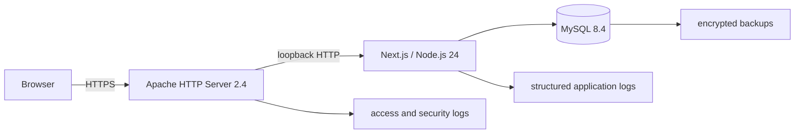

# Astrotools

Astrotools is a production astrophotography planning application. Release 1 will
answer how much sky a telescope and camera capture, whether a target fits, what
image scale the setup produces, and how that sampling compares with stated
seeing.

Work Package 0 establishes the reviewed application foundation, Work Package 1
adds the framework-free field-of-view and image-sampling engine, and Work
Package 2 adds the responsive, accessible calculator shell and production
control primitives. Work Package 3 adds the provenance-rich MySQL equipment and
target catalogue plus its read-only application interfaces.

## Requirements

- Node.js 24.18.0 LTS (see `.nvmrc`)
- npm 11.16.0 (bundled with the pinned Node release)
- MySQL 8.4 LTS for catalogue development and integration tests

With `nvm`, select the pinned runtime and install the exact lockfile:

```bash
nvm install
nvm use
npm ci
```

Start the App Router development server:

```bash
npm run dev
```

Open <http://127.0.0.1:3100>. The production Node service will bind to loopback
behind Apache2; it is not intended to be internet-facing directly.

## Quality commands

```bash
npm run typecheck
npm run lint
npm run format:check
npm run test
npm run test:integration
npm run test:e2e
npm run build
npm run audit:production
```

`npm run test:integration` requires the isolated `astrotools_test` database
described below. The other checks do not require a running database. `npm ci`
generates the ignored Prisma client automatically; `npm run build` regenerates
it as a clean-build safeguard.

Install Playwright browser binaries once before the first end-to-end run:

```bash
npx playwright install chromium firefox webkit
```

Before using the catalogue locally, start MySQL 8.4. Create three disposable,
non-root databases and identities using
[`ops/mysql/development.sql.template`](ops/mysql/development.sql.template).
Generate one SQL- and URL-safe hexadecimal value for each distinct placeholder
name, then replace every repeated occurrence of that name consistently before an
administrator applies the statements:

```bash
openssl rand -hex 32
```

Run that command once for each distinct identity and never reuse its output for
another placeholder. `astrotools_dev` is confined to the development and
dedicated Prisma shadow databases. The integration database has a controlled
`astrotools_test_migrate` owner and a SELECT-only `astrotools_test_app` runtime
identity.

Copy the environment template, replace `CHANGE_ME_DEV`, and keep the resulting
file out of source control:

```bash
cp .env.example .env
```

Generate the Prisma client, create or update a development migration, apply
reviewed migrations, and seed the catalogue with:

```bash
npm run db:generate
npm run db:migrate:dev
npm run db:migrate:deploy
npm run db:seed
```

Never use `db:migrate:dev` in production.

Keep the separate integration identities out of shell history and the process
command line. Copy the ignored local template, restrict its permissions, replace
both placeholders, migrate the test database, and have its administrator apply
the narrow post-migration grants before running the suite:

```bash
cp .env.integration.example .env.integration
chmod 600 .env.integration
# Use the matching generated values for both CHANGE_ME_TEST_* placeholders.
npm run db:migrate:test:deploy
mysql --protocol=tcp --host=127.0.0.1 --user=root --password \
  < ops/mysql/development-read-grants.sql.template
npm run test:integration
```

The runner reads `.env.integration` when present; explicit CI environment values
take precedence. It refuses production mode, MySQL root, a database name without
a distinct `test` segment, and every non-loopback host. Replace both
`CHANGE_ME_TEST_*` placeholders before running it. The suite also proves that
the runtime identity can read only the five API catalogue tables: it cannot
write to them or read the change log and Prisma migration history.

CI starts an isolated MySQL 8.4.10 service, applies migrations, runs the seed
twice to prove idempotency, and verifies a separate SELECT-only runtime
identity. Production uses separate least-privilege runtime and controlled
migration identities; see [.env.example](.env.example) and
[ops/mysql/README.md](ops/mysql/README.md).

CI blocks high-severity findings in production dependencies. `npm run audit:all`
also reports the complete development-tool tree; its current bounded exception
and the temporary Next.js compatibility overrides are recorded in
[`docs/security.md`](docs/security.md). npm's `allowScripts` field is an audited
inventory and warning mechanism in npm 11.16, not an install-script sandbox.

## Architecture



The application uses strict TypeScript and the Next.js App Router. Domain
calculations live in pure functions under `lib/calculations`; React components,
API handlers, and Prisma access cannot own calculation rules.

The accepted target environment is Ubuntu 24.04 LTS. Apache serves
`https://astrotools.smeird.com`, Certbot manages its Let's Encrypt certificate,
the Node service runs on `127.0.0.1:3100`, and MySQL 8.4 LTS runs on the same
host bound to localhost. These decisions guide Work Package 3; deployable
Apache, systemd, backup, and monitoring artifacts remain Work Package 9.

The engine uses canonical millimetres, micrometres, arcseconds, and degrees. Its
public contracts, equations, golden reference case, input policy, and numerical
guarantees are documented in [docs/calculations.md](docs/calculations.md). The
visual tokens, control contracts, responsive reading order, and current scope
boundary are documented in [docs/design-system.md](docs/design-system.md).

Read the
[verbatim implementation baseline](Astrotools_Production_Implementation_Plan.md),
[architecture overview](docs/architecture.md), and
[architecture decisions](docs/adr/) before changing a package boundary. The
confirmed production and catalogue-governance choices are recorded in
[ADR-004](docs/adr/004-production-profile-and-catalogue-governance.md).

## Repository map

```text
app/                         routes and layouts
components/                  shared UI, equation, and visualisation primitives
features/field-of-view/      first calculator feature
lib/                         calculation and infrastructure boundaries
prisma/                      MySQL schema, migrations, and seed entry point
tests/integration/           service and database boundary tests
tests/e2e/                   browser journeys
docs/adr/                    architecture decision records
ops/                         future Apache, systemd, and MySQL examples
```

See [AGENTS.md](AGENTS.md) for the engineering contract and definition of done.
