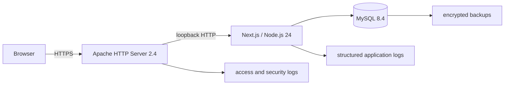

# Astrotools

Astrotools is a production astrophotography planning application. Release 1 will
answer how much sky a telescope and camera capture, whether a target fits, what
image scale the setup produces, and how that sampling compares with stated
seeing.

Work Package 0 establishes the reviewed application foundation. The calculator
engine and catalogue are deliberately not implemented yet.

## Requirements

- Node.js 24.18.0 LTS (see `.nvmrc`)
- npm 11.16.0 (bundled with the pinned Node release)
- MySQL 8.4 LTS from Work Package 3 onward

With `nvm`, select the pinned runtime and install the exact lockfile:

```bash
nvm install
nvm use
npm ci
```

Start the App Router development server:

```bash
npm run dev
```

Open <http://localhost:3000>. The production Node service will bind to loopback
behind Apache2; it is not intended to be internet-facing directly.

## Quality commands

```bash
npm run typecheck
npm run lint
npm run format:check
npm run test
npm run test:integration
npm run test:e2e
npm run build
npm run audit:production
```

Install Playwright browser binaries once before the first end-to-end run:

```bash
npx playwright install chromium firefox webkit
```

Database commands are present for a stable operational interface. Before using
them, copy the development template and replace its placeholder password with
credentials for a non-production MySQL database:

```bash
cp .env.example .env
```

Work Package 3 will add catalogue models, migrations, seed data, and MySQL
integration tests:

```bash
npm run db:generate
npm run db:migrate:dev
npm run db:migrate:deploy
npm run db:seed
```

Never use `db:migrate:dev` in production.

CI blocks high-severity findings in production dependencies. `npm run audit:all`
also reports the complete development-tool tree; its current bounded exception
and the temporary Next.js compatibility overrides are recorded in
[`docs/security.md`](docs/security.md). npm's `allowScripts` field is an audited
inventory and warning mechanism in npm 11.16, not an install-script sandbox.

## Architecture



The application uses strict TypeScript and the Next.js App Router. Domain
calculations live in pure functions under `lib/calculations`; React components,
API handlers, and Prisma access cannot own calculation rules.

Read the
[verbatim implementation baseline](Astrotools_Production_Implementation_Plan.md),
[architecture overview](docs/architecture.md), and
[architecture decisions](docs/adr/) before changing a package boundary.

## Repository map

```text
app/                         routes and layouts
components/                  shared UI, equation, and visualisation primitives
features/field-of-view/      first calculator feature
lib/                         calculation and infrastructure boundaries
prisma/                      MySQL schema, migrations, and seed entry point
tests/integration/           service and database boundary tests
tests/e2e/                   browser journeys
docs/adr/                    architecture decision records
ops/                         future Apache, systemd, and MySQL examples
```

See [AGENTS.md](AGENTS.md) for the engineering contract and definition of done.
