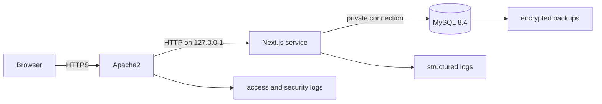

# Architecture overview

- Status: accepted foundation
- Date: 29 July 2026
- Updated: 30 July 2026

Astrotools is one strict TypeScript application using the Next.js App Router.
Apache HTTP Server 2.4 terminates TLS and proxies trusted requests to a
standalone Node.js 24 service bound to `127.0.0.1:3100`. MySQL 8.4 LTS stores
curated equipment and target catalogue data on the same Ubuntu 24.04 LTS host,
bound to `127.0.0.1`.

## Boundaries

- `app/` coordinates routes, rendering, and API boundaries.
- `features/field-of-view/` owns the first calculator's orchestration and UI.
- `lib/calculations/` owns pure, deterministic, framework-free mathematics.
- `lib/db/` owns Prisma client creation and catalogue queries from Work
  Package 3.
- Browser-side calculations update without API latency or database writes.
- Zod schemas validate URL, API, and environment input at their boundaries.
- Apache owns public forwarding, request limits, static caching, and security
  headers. Only forwarding headers from the loopback proxy are trusted.

## Runtime and persistence

The production build uses Next.js standalone output. The accepted deployment
model uses direct, versioned release directories; systemd will run the Node
process as a dedicated unprivileged identity and load secrets from an external,
root-controlled environment file. Prisma Migrate runs as a controlled release
step with credentials distinct from the least-privilege runtime account.

MySQL measurements use DECIMAL rather than FLOAT. Catalogue records retain
provenance, verification date, and inactive records needed by old shared URLs.
Runtime scraping is prohibited.

Apache will serve `astrotools.smeird.com` and Certbot will manage its Let's
Encrypt certificate. Prometheus/Alertmanager-compatible monitoring and nightly,
encrypted S3-compatible database backups with 30 daily restore points are the
accepted operational targets. Their deployable configuration and runbooks are
deliberately deferred to Work Package 9.

## Evolution

The first real calculator establishes the calculator contract and design-system
primitives. A registry may be extracted when a second calculator needs it; Work
Package 0 does not invent that abstraction. See the accepted ADRs for rationale
and consequences.
